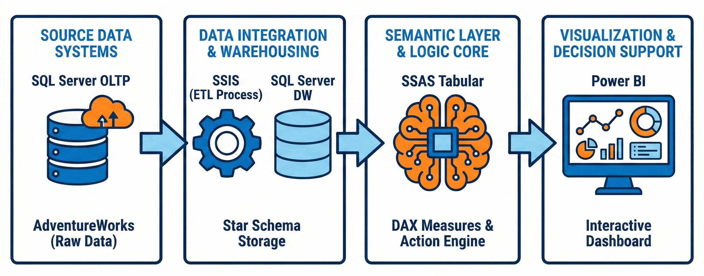
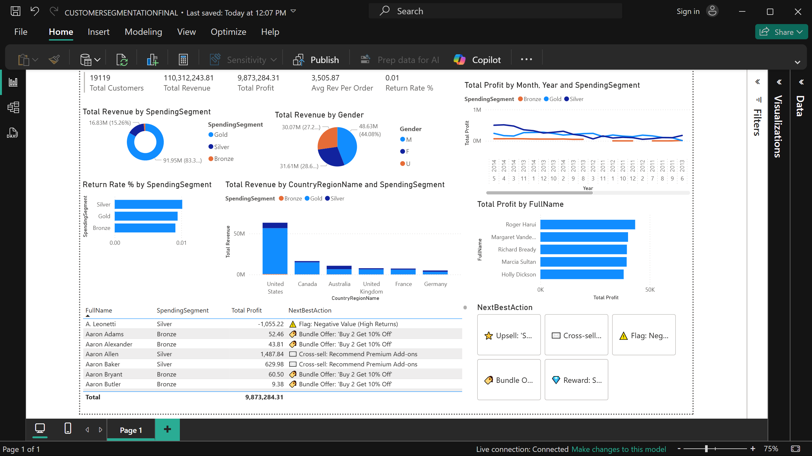

### 🚀 Overview
This project is an end-to-end **Decision Support System (DSS)** that transforms raw transactional data from the AdventureWorks database into actionable marketing intelligence. Unlike traditional reports that only show historical sales, this system implements a prescriptive **"Action Engine"** that automatically classifies customers and recommends specific next steps (e.g., Upsell, Churn Prevention, or Risk Flagging).

---

### 🏗️ Architecture
The system follows a Microsoft BI 3-Tier Architecture, decoupling data storage, business logic, and visualization for scalability.



* **Source:** AdventureWorks OLTP (SQL Server).
* **Data Warehouse (SQL & SSIS):** A Star Schema optimized for performance. Features derived logic for Gender and standardized costs.
* **Semantic Layer (SSAS Tabular):** The "Brain" of the system. It hosts the centralized DAX logic for Profit, Returns, and Customer Segmentation.
* **Visualization (Power BI):** A Live Connection interface that enables interactive "What-If" analysis.

---

### 📊 The Dashboard
The "Command Center" allows marketing managers to filter the entire customer base by strategic action rather than just browsing tables.



**Key Features:**
* **Executive Scorecard:** Real-time KPIs including Net Profit and Return Rate %.
* **Profit Trends:** Analysis of financial performance over time by segment.
* **The Action Command Center:** A tile-based slicer that generates targeted lists based on the **Next Best Action** logic.

---

### 🛠️ How to Run This Project
**Prerequisites:** SQL Server, Visual Studio (with SSDT), Power BI Desktop.

1.  **Database Setup:**
    * Navigate to the `/Database` folder.
    * Execute `DW_Schema.sql` in SSMS to generate the Data Warehouse tables.
2.  **ETL Execution (SSIS):**
    * Open the solution in `/SSIS_ETL` using Visual Studio.
    * Configure the Connection Managers to point to your local SQL instance.
    * Run the packages to populate the Data Warehouse.
3.  **Deploy Semantic Model (SSAS):**
    * Open the project in `/SSAS_Model`.
    * Update the "Data Sources" with your credentials.
    * Right-click the project -> **Deploy** to your local Analysis Services instance.
4.  **View Report:**
    * Open `/PowerBI_Report/Segmentation_Dashboard.pbix`.
    * Ensure it connects to your local SSAS instance (`localhost`).

---

### 💡 Result & Insights
* **Profit vs. Revenue Trap:** The analysis revealed that several "High Revenue" customers were actually **Unprofitable** due to high return rates and shipping costs.
* **Behavioral Segmentation:** Customers are segmented into **Gold/Silver/Bronze** based on actual Lifetime Spend, proving to be a reliable predictor of future value.
* **Automated Targeting:** The "Next Best Action" engine successfully identifies "Climber" customers (Silver tier close to Gold threshold), providing a ready-made list for upsell campaigns.

---

### 📂 Repository Structure
```text
AdventureWorks-DSS-Analytics/
│
├── Database/                        # SQL Scripts for Star Schema Generation
│   └── DW_Schema.sql
│
├── SSIS_ETL/                        # ETL Packages (Data Integration)
│   ├── AdventureWorks_ETL.sln
│   └── Package.dtsx
│
├── SSAS_Model/                      # Semantic Layer & DAX Logic
│   ├── Model.bim
│   └── AdventureWorks_Analysis.sln
│
├── PowerBI_Report/                  # Interactive Dashboard Source
│   └── Segmentation_Dashboard.pbix
│
├── assets/                          # Project Screenshots & Diagrams
│   ├── architecture_diagram.png
│   └── dashboard_screenshot.png
│
├── Project_Report.pdf               # Full PDF Documentation & Design
└── README.md                        # Project Overview
